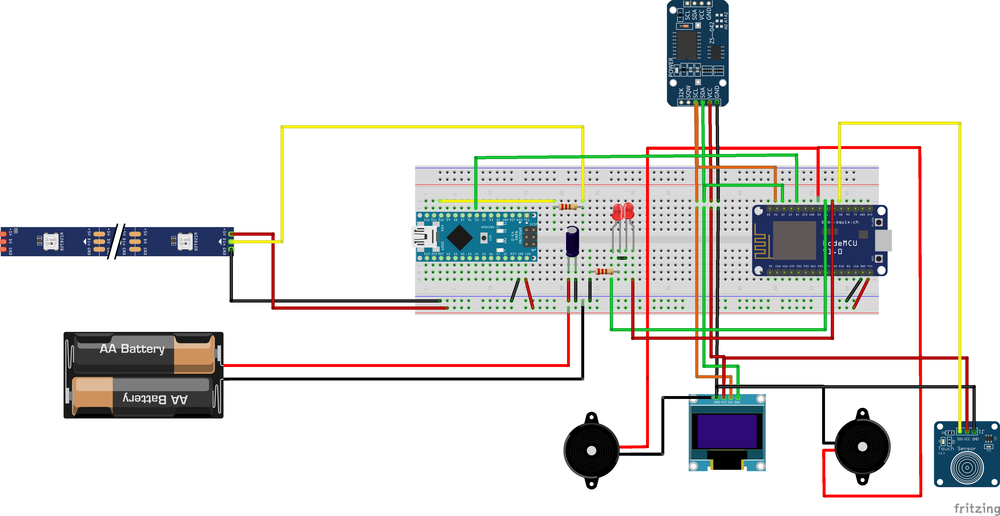
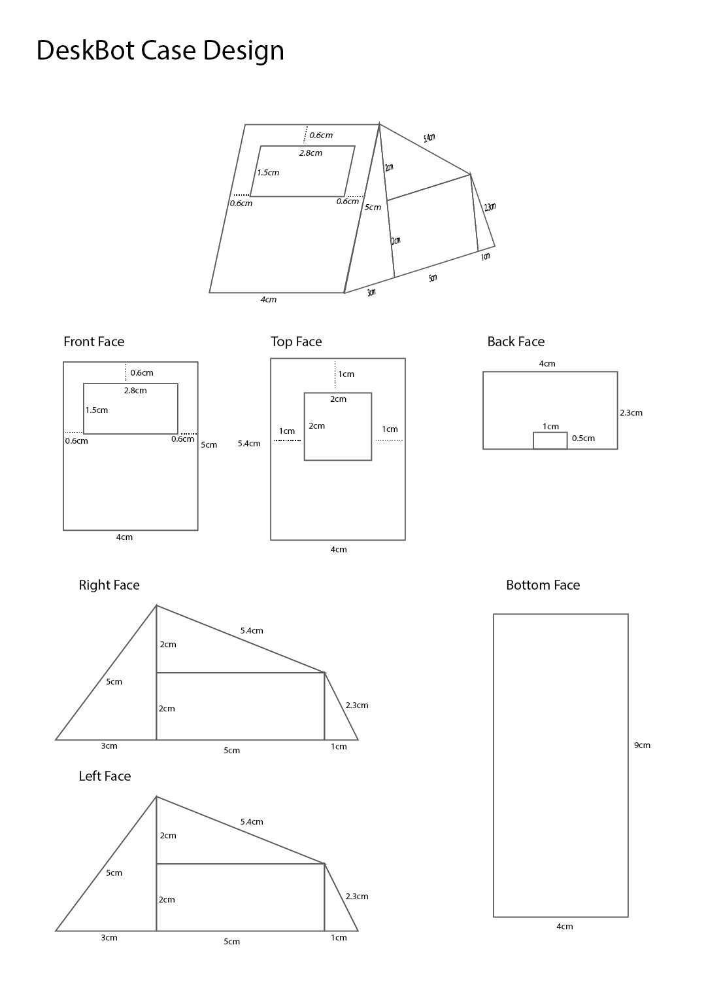

# DeskBot©

A Little Robot With Lot's of Potential...

<hr />

## Features✨

- RGB LED Strip Control
- Clock
- Weather
- Alarms
- Sync to Spotify Music and Play / Pause
- Control Basic LED Strip Patterns from The Web Server
- Automatic Time Setting on Startup
- Easy Access to Web server via https://deskbot.netlify.app/

<hr />

## Circuitry🔌

Parts Needed...

- NodeMCU CP2102
- Arduino Nano R3
- SSD1306 OLED Display
- Capacitive Touch Sensor
- Piezo Buzzers
- DS3231 RTC Module
- WS2812 RGB LED Strip
- Power Supply (5V 10A AC to DC)
- 180Ω - 220Ω Resistors
- 100uf Capaciticator
- Red and Green LED
- Switches (For Break Connections when Uploading a Sketch)
- Wires and Breadboards to Make Connections

<br>

> To Calculate The Amp of the Power Supply

```
Every LED consists of 3 Red, Green, Blue lights.

That Single LED Uses 20mA.

So a LED With Full Brightness with White Color uses 60mA.


Minimum Amps Needed at full Power Usage = NUM_OF_LEDS * 60
```



<hr />

<br>

## Bot Casing🤖

<br>



<hr />

<br>

## Libraries and Features Used🔧

- [Spotify API Arduino](https://github.com/witnessmenow/spotify-api-arduino)

- [Cute Buzzer Sounds](https://github.com/GypsyRobot/CuteBuzzerSounds)

- [FastLED](https://github.com/FastLED/FastLED)

- [NTP Client](https://github.com/arduino-libraries/NTPClient)

- [Open Weather Map](https://openweathermap.org/)

<hr />

<br>

## Changing Alarms

- Change Variables Accordingly in this code block from line 39

```
//  Alarms

int alarm1[2] = {4, 15};          //  Alarm {hour, minute}
bool alarm1_on = false;           //  Alarm Easy Toggle
String alarm1_des = "Wake Up..."; //  Alarm Description - Max 21 Characters
int alarm1_duration = 5;          //  Alarm Duration in Minutes

int alarm2[2] = {4, 30};          //  Alarm {hour, minute}
bool alarm2_on = false;           //  Alarm Easy Toggle
String alarm2_des = "Wake Up..."; //  Alarm Description - Max 21 Characters
int alarm2_duration = 10;         //  Alarm Duration in Minutes

int alarm3[2] = {4, 45};          //  Alarm {hour, minute}
bool alarm3_on = false;           //  Alarm Easy Toggle
String alarm3_des = "Wake Up..."; //  Alarm Description - Max 21 Characters
int alarm3_duration = 10;         //  Alarm Duration in Minutes

int alarm4[2] = {5, 0};           //  Alarm {hour, minute}
bool alarm4_on = false;           //  Alarm Easy Toggle
String alarm4_des = "Wake Up..."; //  Alarm Description - Max 21 Characters
int alarm4_duration = 10;         //  Alarm Duration in Minutes

int alarm5[2] = {5, 15};          //  Alarm {hour, minute}
bool alarm5_on = false;           //  Alarm Easy Toggle
String alarm5_des = "Wake Up..."; //  Alarm Description - Max 21 Characters
int alarm5_duration = 10;         //  Alarm Duration in Minutes
```

<hr />

<br>

## If You Want to Setup This,

- Download as a Zip File and Upload codes to boards separately.

> Please refer the Libraries Mentioned Above and Change the variables According to them.

- Change Variables Accordingly in this code block from line 66

```
//  Declareations

const char *ssid = "WIFI_SSID";
const char *password = "WIFI_PASSWORD";

String openWeatherMapApiKey = "APIKEY_FROM_OPENWEATHERMAP";

String city = "YOUR_CITY_YO_GET_WEATHER_INFO";
String countryCode = "YOUR_COUNTRY_CODE"; // Ex- LK, US, UK

char clientId[] = "CLIENT_ID";         // Your client ID of your spotify APP
char clientSecret[] = "CLIENT_SECRET"; // Your client Secret of your spotify APP (Do Not share this!)

#define SPOTIFY_MARKET "YOUR_COUNTRY_CODE" // Ex- LK, US, UK

#define SPOTIFY_REFRESH_TOKEN "REFRESH_TOKEN_FROM_LIBRARY"

int time_offset = 19800; // Change according to Time Zone (GMT 0 = 0, GMT +1 = 3600, GMT +2 = 7200, GMT -1 = -3600 likewise)

//  Variables - Startup LED Strip State

bool lights = false;    // Light on - true, off - false
int mode_of_lights = 0; // 0 - Normal, 1 - Gaming, 2 - Study
```

```
Find Open Weather map API Key from the link mentioned below after signing in.
```

- https://home.openweathermap.org/api_keys

```
To Obtain Spotify based variables and keys please refer Spotify API Arduino library mentioned earlier.
```

`If You encounter any Problems Feel Free to Contact Me 😉`


