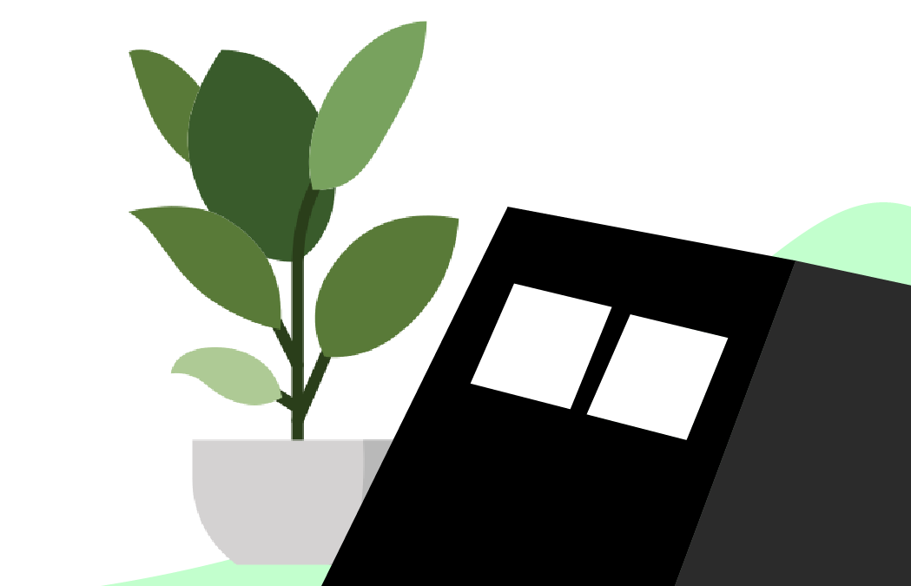

# DeskBot©

A Little Robot With Lot's of Potential...

<hr />

## Features✨

- RGB LED Strip Control
- Clock
- Weather
- Alarms
- Sync to Spotify Music and Play / Pause
- Control Basic LED Strip Patterns from The Web Server
- Automatic Time Setting on Startup
- Easy Access to Web server via https://deskbot.netlify.app/

<hr />

## Circuitry🔌

Parts Needed...

- NodeMCU CP2102
- Arduino Nano R3
- SSD1306 OLED Display
- Capacitive Touch Sensor
- Piezo Buzzers
- DS3231 RTC Module
- WS2812 RGB LED Strip
- Power Supply (5V 10A AC to DC)
- 180Ω - 220Ω Resistors
- 100uf Capaciticator
- Red and Green LED
- Switches (For Break Connections when Uploading a Sketch)
- Wires and Breadboards to Make Connections

<br>

> To Calculate The Amp of the Power Supply

```
Every LED consists of 3 Red, Green, Blue lights.

That Single LED Uses 20mA.

So a LED With Full Brightness with White Color uses 60mA.


Minimum Amps Needed at full Power Usage = NUM_OF_LEDS * 60
```


<hr />

<br>

## Bot Casing🤖

<br>


<hr />

<br>

## Libraries and Features Used🔧

- [Spotify API Arduino](https://github.com/witnessmenow/spotify-api-arduino)

- [Cute Buzzer Sounds](https://github.com/GypsyRobot/CuteBuzzerSounds)

- [FastLED](https://github.com/FastLED/FastLED)

- [NTP Client](https://github.com/arduino-libraries/NTPClient)

- [Open Weather Map](https://openweathermap.org/)

<hr />

<br>

## If You Want to Setup This,

> Please refer the Libraries Mentioned Above and Change the variables According to them.


